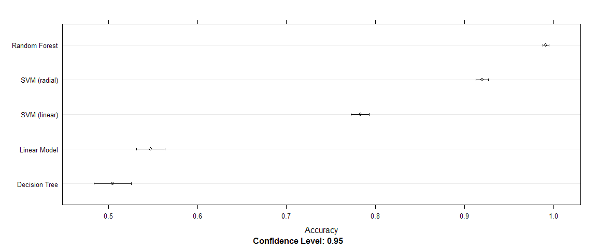

# Predicting Exercise Type
McReyar  
Practical Machine Learning (predmachlearn-004) / Coursera  
##Synopsis
In this paper activities are predicted based on the data of wearable accelerometers. After loading and preprocessing the data, several different models and tuning parameters are built and the best model is selected. Finally the best model is used to make predictions on a test dataset.

##Data Preparation
Following libraries are used for this project:

```r
library(knitr)
library(lattice)
library(ggplot2)
library(caret)
library(glmnet)
```

```
## Loading required package: Matrix
## Loaded glmnet 1.9-8
```

```r
library(rpart)
library(kernlab)
library(randomForest)
```

```
## randomForest 4.6-10
## Type rfNews() to see new features/changes/bug fixes.
```

###Data Source and Format
For the analysis the dataset [Human Activity Recognition][1] is used which was gathered by Velloso, Bulling, Gellersen, Ugulino and Fuks[^1].

```r
if(!file.exists("pml-training.csv") | !file.exists("pml-testing.csv")) {
    download.file("http://d396qusza40orc.cloudfront.net/predmachlearn/pml-training.csv"
                 ,destfile = "pml-training.csv")
    download.file("http://d396qusza40orc.cloudfront.net/predmachlearn/pml-testing.csv"
                 ,destfile = "pml-testing.csv")
    download.date <- format(Sys.time(),"%m/%d/%Y %I:%M %p %Z", tz = "UTC")
}
```
For this paper the file has been downloaded on 08/17/2014 09:58 AM UTC.

The data is separated by commas and "NA", "" or "#DIV/0!" are interpreted as missing values. The first 7 columns aren't read, because they include IDs, names, timestamps and other data that is not relevant for the analysis.

```r
pml      <- read.csv("pml-training.csv", na.strings = c("\"\"","NA","#DIV/0!")
                    ,colClasses = c(rep("NULL",7),rep(NA,152),"factor"))
predict  <- read.csv("pml-testing.csv", na.strings = c("\"\"","NA","#DIV/0!")
                    ,colClasses = c(rep("NULL",7),rep(NA,152),"NULL"))
```
For estimating the out of sample error, 30% of the data is set aside as testing set.

```r
set.seed(157885)
inTrain <- sort(createDataPartition(y = pml$classe, p = 0.7, list = FALSE))
training   <- pml[ inTrain,]
testing    <- pml[-inTrain,]
```

###Missing Values

```r
naCols <- colSums(is.na(training))
sumMissing <- sum(naCols > 0)
minMissing <- min(naCols[naCols > 0])
```
There are 100 columns with missing values and for each of these the values are missing for the majority of rows (at least 13452). Because of this, imputing the missing values  isn't feasible and the columns are therefore discarded for further analysis. 

```r
for(n in seq(ncol(training),1)) {
    if(naCols[n] > 0) {
        training[,n] <- NULL
        testing[,n]  <- NULL
        pml[,n]      <- NULL
        predict[,n]  <- NULL
    }
}
dim(training)
```

```
## [1] 13737    53
```
Because there are still 53 columns left, a summary isn't printed in this paper, although it was checked for the analysis.


##Training Models
The activity classes have following frequencies

```r
kable(data.frame(Activity  = levels(training$classe)
                ,Frequency = paste0(round(100*prop.table(table(training$classe)),2),"%")
                )
     ,format = "html")
```

<table>
 <thead>
  <tr>
   <th align="left"> Activity </th>
   <th align="left"> Frequency </th>
  </tr>
 </thead>
<tbody>
  <tr>
   <td align="left"> A </td>
   <td align="left"> 28.43% </td>
  </tr>
  <tr>
   <td align="left"> B </td>
   <td align="left"> 19.35% </td>
  </tr>
  <tr>
   <td align="left"> C </td>
   <td align="left"> 17.44% </td>
  </tr>
  <tr>
   <td align="left"> D </td>
   <td align="left"> 16.39% </td>
  </tr>
  <tr>
   <td align="left"> E </td>
   <td align="left"> 18.38% </td>
  </tr>
</tbody>
</table>
Therefore the baseline for our model is an accuracy of 28.43%.  

For tuning the models 5-fold cross validation is used.

```r
trControl <- trainControl(method = "cv", number = 5)
```
To get the best final model following methods are used and compared:

* Regularized Generalized Linear Model
* Decision Tree
* Support Vector Machine (linear kernel)
* Support Vector Machine (radial kernel)
* Random Forest  
For all models numeric values are centered and scaled.

###Regularized Generalized Linear Model (glmnet)

```r
set.seed(157885)
model.glm <- train(classe ~ ., data = training, method = "glmnet"
                   ,trControl = trControl, preProcess = c("center","scale")
)
print(model.glm)
```

```
## glmnet 
## 
## 13737 samples
##    52 predictors
##     5 classes: 'A', 'B', 'C', 'D', 'E' 
## 
## Pre-processing: centered, scaled 
## Resampling: Cross-Validated (5 fold) 
## 
## Summary of sample sizes: 10989, 10991, 10989, 10990, 10989 
## 
## Resampling results across tuning parameters:
## 
##   alpha  lambda  Accuracy  Kappa  Accuracy SD  Kappa SD
##   0.1    0.1     0.5       0.4    0.01         0.02    
##   0.1    0.5     0.4       0.1    0.001        0.001   
##   0.1    0.8     0.3       9e-04  5e-04        5e-04   
##   0.1    1       0.3       0      2e-04        0       
##   0.1    2       0.3       0      2e-04        0       
##   0.1    2       0.3       0      2e-04        0       
##   0.1    2       0.3       0      2e-04        0       
##   0.1    3       0.3       0      2e-04        0       
##   0.1    3       0.3       0      2e-04        0       
##   0.6    0.1     0.4       0.2    0.007        0.009   
##   0.6    0.5     0.3       0      2e-04        0       
##   0.6    0.8     0.3       0      2e-04        0       
##   0.6    1       0.3       0      2e-04        0       
##   0.6    2       0.3       0      2e-04        0       
##   0.6    2       0.3       0      2e-04        0       
##   0.6    2       0.3       0      2e-04        0       
##   0.6    3       0.3       0      2e-04        0       
##   0.6    3       0.3       0      2e-04        0       
##   1      0.1     0.3       0.07   0.005        0.007   
##   1      0.5     0.3       0      2e-04        0       
##   1      0.8     0.3       0      2e-04        0       
##   1      1       0.3       0      2e-04        0       
##   1      2       0.3       0      2e-04        0       
##   1      2       0.3       0      2e-04        0       
##   1      2       0.3       0      2e-04        0       
##   1      3       0.3       0      2e-04        0       
##   1      3       0.3       0      2e-04        0       
## 
## Accuracy was used to select the optimal model using  the largest value.
## The final values used for the model were alpha = 0.1 and lambda = 0.1.
```
###Decision Tree (CART)

```r
set.seed(157885)
model.rpart <- train(classe ~ ., data = training, method = "rpart"
                     ,trControl = trControl, preProcess = c("center","scale")
)
print(model.rpart)
```

```
## CART 
## 
## 13737 samples
##    52 predictors
##     5 classes: 'A', 'B', 'C', 'D', 'E' 
## 
## Pre-processing: centered, scaled 
## Resampling: Cross-Validated (5 fold) 
## 
## Summary of sample sizes: 10989, 10991, 10989, 10990, 10989 
## 
## Resampling results across tuning parameters:
## 
##   cp    Accuracy  Kappa  Accuracy SD  Kappa SD
##   0.04  0.5       0.4    0.02         0.02    
##   0.06  0.5       0.3    0.06         0.1     
##   0.1   0.3       0.07   0.04         0.07    
## 
## Accuracy was used to select the optimal model using  the largest value.
## The final value used for the model was cp = 0.04.
```
###Support Vector Machine (linear kernel)

```r
set.seed(157885)
model.svml <- train(classe ~ ., data = training, method = "svmLinear"
                    ,trControl = trControl, preProcess = c("center","scale")
)
print(model.svml)
```

```
## Support Vector Machines with Linear Kernel 
## 
## 13737 samples
##    52 predictors
##     5 classes: 'A', 'B', 'C', 'D', 'E' 
## 
## Pre-processing: centered, scaled 
## Resampling: Cross-Validated (5 fold) 
## 
## Summary of sample sizes: 10989, 10991, 10989, 10990, 10989 
## 
## Resampling results
## 
##   Accuracy  Kappa  Accuracy SD  Kappa SD
##   0.8       0.7    0.008        0.01    
## 
## Tuning parameter 'C' was held constant at a value of 1
## 
```
###Support Vector Machine (radial kernel)

```r
set.seed(157885)
model.svmr <- train(classe ~ ., data = training, method = "svmRadial"
                    ,trControl = trControl, preProcess = c("center","scale")
)
print(model.svmr)
```

```
## Support Vector Machines with Radial Basis Function Kernel 
## 
## 13737 samples
##    52 predictors
##     5 classes: 'A', 'B', 'C', 'D', 'E' 
## 
## Pre-processing: centered, scaled 
## Resampling: Cross-Validated (5 fold) 
## 
## Summary of sample sizes: 10989, 10991, 10989, 10990, 10989 
## 
## Resampling results across tuning parameters:
## 
##   C    Accuracy  Kappa  Accuracy SD  Kappa SD
##   0.2  0.9       0.8    0.008        0.01    
##   0.5  0.9       0.9    0.007        0.009   
##   1    0.9       0.9    0.006        0.007   
## 
## Tuning parameter 'sigma' was held constant at a value of 0.01251
## Accuracy was used to select the optimal model using  the largest value.
## The final values used for the model were sigma = 0.01 and C = 1.
```
###Random Forrests

```r
set.seed(157885)
model.rf <- train(classe ~ ., data = training, method = "rf"
                  ,trControl = trControl, preProcess = c("center","scale")
)
print(model.rf)
```

```
## Random Forest 
## 
## 13737 samples
##    52 predictors
##     5 classes: 'A', 'B', 'C', 'D', 'E' 
## 
## Pre-processing: centered, scaled 
## Resampling: Cross-Validated (5 fold) 
## 
## Summary of sample sizes: 10989, 10991, 10989, 10990, 10989 
## 
## Resampling results across tuning parameters:
## 
##   mtry  Accuracy  Kappa  Accuracy SD  Kappa SD
##   2     1         1      0.003        0.004   
##   30    1         1      0.003        0.004   
##   50    1         1      0.003        0.003   
## 
## Accuracy was used to select the optimal model using  the largest value.
## The final value used for the model was mtry = 27.
```
##Model Selection
Finally the accuracy of the five models is compared:

```r
resamps <- resamples(list(model.glm, model.rpart, model.svml, model.svmr, model.rf)
                     ,modelNames = c("Linear Model"
                                    ,"Decision Tree"
                                    ,"SVM (linear)"
                                    ,"SVM (radial)"
                                    ,"Random Forest"))
trellis.par.set(caretTheme())
dotplot(resamps, metric = "Accuracy")
```

 
As can be seen, Random Forest has by far the highest accuary (99.11%). With so much more accuracy a loss of interpretability seems to be acceptable. Further optimization by model stacking seems not to be worth the effort.

##Final Model
With the best model the activity of the test data is predicted and compared with the real activity.

```r
confMat <- confusionMatrix(predict(model.rf, newdata=testing), testing$classe)
print(confMat)
```

```
## Confusion Matrix and Statistics
## 
##           Reference
## Prediction    A    B    C    D    E
##          A 1672   12    0    0    0
##          B    1 1126    7    1    0
##          C    0    1 1018   16    0
##          D    0    0    1  946    2
##          E    1    0    0    1 1080
## 
## Overall Statistics
##                                        
##                Accuracy : 0.993        
##                  95% CI : (0.99, 0.995)
##     No Information Rate : 0.284        
##     P-Value [Acc > NIR] : <2e-16       
##                                        
##                   Kappa : 0.991        
##  Mcnemar's Test P-Value : NA           
## 
## Statistics by Class:
## 
##                      Class: A Class: B Class: C Class: D Class: E
## Sensitivity             0.999    0.989    0.992    0.981    0.998
## Specificity             0.997    0.998    0.997    0.999    1.000
## Pos Pred Value          0.993    0.992    0.984    0.997    0.998
## Neg Pred Value          1.000    0.997    0.998    0.996    1.000
## Prevalence              0.284    0.194    0.174    0.164    0.184
## Detection Rate          0.284    0.191    0.173    0.161    0.184
## Detection Prevalence    0.286    0.193    0.176    0.161    0.184
## Balanced Accuracy       0.998    0.993    0.994    0.990    0.999
```
Similar to the accuracy obtained by cross validation, the out of sample accuracy is also very high (99.27)%. We would expect about 0.73% classification errors.

As these results confirm the findings based on cross validation, the final model is built with random forest and the parameters of the best model on the whole dataset.

```r
finalModel <- train(classe ~ ., data = pml, method = "rf"
                   ,preProcess = c("center","scale")
                   ,trControl  = trainControl(method = "none")
                   ,tuneGrid   = model.rf$bestTune
                   )
```
This model is used to make a prediction on the 20 real-world cases for which the real activity is not known.

```r
kable(data.frame(Row = row.names(predict)
                ,Prediction = predict(finalModel, newdata=predict)))
```


|Row |Prediction |
|:---|:----------|
|1   |B          |
|2   |A          |
|3   |B          |
|4   |A          |
|5   |A          |
|6   |E          |
|7   |D          |
|8   |B          |
|9   |A          |
|10  |A          |
|11  |B          |
|12  |C          |
|13  |B          |
|14  |A          |
|15  |E          |
|16  |E          |
|17  |A          |
|18  |B          |
|19  |B          |
|20  |B          |

#References
[^1]: Velloso, E.; Bulling, A.; Gellersen, H.; Ugulino, W.; Fuks, H. Qualitative Activity Recognition of Weight Lifting Exercises. Proceedings of 4th International Conference in Cooperation with SIGCHI (Augmented Human '13) . Stuttgart, Germany: ACM SIGCHI, 2013.

[1]: http://groupware.les.inf.puc-rio.br/har
